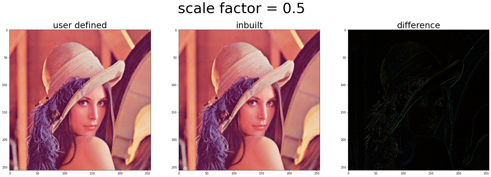

# Question 1 and 2


```
def read_matrix(filename):
	f=open(filename,'r')
	m=int(f.readline().split()[0])
	mat=[]
	for i in range(m):
		row=[int(i) for i in f.readline().split()]
		mat.append(row)
	f.close()
	return mat

def sum(mat):
	s=0
	for row in mat:
		for elem in row:
			s+=elem
	return s

def maximum(mat):
	m=mat[0][0]
	for row in mat:
		for elem in row:
			if elem>m:
				m=elem
	return m

def mean(mat):
	return sum(mat)/(len(mat)*len(mat[0]))

def median(mat):
	l=[]
	for row in mat:
		l.extend(row)
	l.sort()
	n=len(l)
	# consider median = middle element if total number of elements is odd
	# else median = mean of middle two elements
	return l[int(n/2)] if n%2==1 else (l[int(n/2)-1]+l[int(n/2)])/2

def frequency_distribution(mat):
	freq={}
	for row in mat:
		for elem in row:
			freq[elem]=freq.get(elem,0)+1
	return freq

def mode(mat):
	freq=frequency_distribution(mat)
	max_freq=freq[max(freq,key=freq.get)]
	mode=[]
	for i in freq:
		if freq[i]==max_freq:
			mode.append(i)
	return mode

def standard_deviation(mat):
	mat_with_sq_entires=[[elem**2 for elem in row] for row in mat]
	return (mean(mat_with_sq_entires)-mean(mat)**2)**0.5

def print_matrix(mat):
	x=len(str(maximum(mat)))
	for row in mat:
		print('    ',end='')
		for elem in row:
			print(f"{elem:^{x}}",end=' ')
		print()

def print_frequency(freq):
	x=len(str(max(freq.keys())))
	for i in sorted(freq.keys()):
		print(f"    {i:^{x}} {'█'*freq[i]} {freq[i]}")

def print_all_statistics(mat):
		print_matrix(mat)
		print(f"sum = {sum(mat)}")
		print(f"maximum = {maximum(mat)}")
		print(f"mean = {mean(mat)}")
		print(f"median = {median(mat)}")
		md=mode(mat)
		if len(md)==1:
			print(f"mode = {md[0]}")
		else:
			print(f"set of modes = {md}")
		print(f"standard deviation = {standard_deviation(mat)}")
		print(f"frequency distribution:")
		freq=frequency_distribution(mat)
		print_frequency(freq)

def q1(filename):
  print(filename+":")
  mat=read_matrix(filename)
  print_all_statistics(mat)

q1('a')
print("="*40)
q1('b')
print("="*40)
q1('c')
print("="*40)
q1('d')
```

    a:
        1 6 0 6 8 
        1 1 5 7 8 
        4 2 4 9 8 
        2 0 5 7 4 
        7 5 9 3 0 
    sum = 112
    maximum = 9
    mean = 4.48
    median = 5
    set of modes = [1, 0, 8, 5, 7, 4]
    standard deviation = 2.9273879141651173
    frequency distribution:
        0 ███ 3
        1 ███ 3
        2 ██ 2
        3 █ 1
        4 ███ 3
        5 ███ 3
        6 ██ 2
        7 ███ 3
        8 ███ 3
        9 ██ 2
    ========================================
    b:
        8 3 8 8 8 
        7 6 3 4 0 
        4 6 2 4 8 
        4 1 7 0 0 
        8 8 7 3 5 
    sum = 122
    maximum = 8
    mean = 4.88
    median = 5
    mode = 8
    standard deviation = 2.7758962516635957
    frequency distribution:
        0 ███ 3
        1 █ 1
        2 █ 1
        3 ███ 3
        4 ████ 4
        5 █ 1
        6 ██ 2
        7 ███ 3
        8 ███████ 7
    ========================================
    c:
        5 3 4 7 3 
        9 2 8 9 7 
        1 9 6 5 2 
        5 3 6 6 2 
        0 5 1 3 7 
    sum = 118
    maximum = 9
    mean = 4.72
    median = 5
    set of modes = [5, 3]
    standard deviation = 2.615645235883491
    frequency distribution:
        0 █ 1
        1 ██ 2
        2 ███ 3
        3 ████ 4
        4 █ 1
        5 ████ 4
        6 ███ 3
        7 ███ 3
        8 █ 1
        9 ███ 3
    ========================================
    d:
        7 5 3 1 0 
        2 6 9 7 9 
        9 1 1 9 4 
        8 9 4 1 7 
        1 8 4 1 2 
    sum = 118
    maximum = 9
    mean = 4.72
    median = 4
    mode = 1
    standard deviation = 3.1939943644283404
    frequency distribution:
        0 █ 1
        1 ██████ 6
        2 ██ 2
        3 █ 1
        4 ███ 3
        5 █ 1
        6 █ 1
        7 ███ 3
        8 ██ 2
        9 █████ 5


```
from random import randrange

r=int(input("enter number of rows: "))
c=int(input("enter number of columns: "))

mat=[[randrange(11) for i in range(c)] for i in range(r)]
print("random matrix:")
print_all_statistics(mat)
```

    enter number of rows: 6
    enter number of columns: 8
    random matrix:
        3  4  1  0  3  8  3  0  
        0  10 10 4  9  5  10 4  
        10 1  9  4  9  4  9  0  
        9  8  7  3  10 1  4  4  
        9  3  2  3  0  7  5  7  
        4  9  1  5  2  2  9  8  
    sum = 242
    maximum = 10
    mean = 5.041666666666667
    median = 4.0
    set of modes = [4, 9]
    standard deviation = 3.353843152100122
    frequency distribution:
        0  █████ 5
        1  ████ 4
        2  ███ 3
        3  ██████ 6
        4  ████████ 8
        5  ███ 3
        7  ███ 3
        8  ███ 3
        9  ████████ 8
        10 █████ 5


# Question 3

## Download and load the image.


```
!wget https://upload.wikimedia.org/wikipedia/en/7/7d/Lenna_%28test_image%29.png -O Lenna.png
from google.colab.patches import cv2_imshow
import cv2

img = cv2.imread("Lenna.png")

img_gray = cv2.cvtColor(img, cv2.COLOR_BGR2GRAY)
cv2_imshow(img_gray)
```

    --2021-02-19 14:45:31--  https://upload.wikimedia.org/wikipedia/en/7/7d/Lenna_%28test_image%29.png
    Resolving upload.wikimedia.org (upload.wikimedia.org)... 208.80.154.240, 2620:0:861:ed1a::2:b
    Connecting to upload.wikimedia.org (upload.wikimedia.org)|208.80.154.240|:443... connected.
    HTTP request sent, awaiting response... 200 OK
    Length: 473831 (463K) [image/png]
    Saving to: ‘Lenna.png’
    
    Lenna.png           100%[===================>] 462.73K  --.-KB/s    in 0.06s   
    
    2021-02-19 14:45:31 (7.50 MB/s) - ‘Lenna.png’ saved [473831/473831]
    


    

    


## Some functions
`gen_samples`: generates and returns `tot_samples` number of samples of noise type `mode`

`q3`: Computes the average of the returned samples from `gen_samples` in the way specified by the question.


```
from skimage.util import random_noise
import numpy as np
import matplotlib.pyplot as plt

def gen_samples(img, mode, tot_samples):

    img_samples = []

    avg = np.zeros(img.shape)
    for i in range(tot_samples):
        img_samples.append((random_noise(img_gray, mode=mode)*255).astype(np.uint8))

    return img_samples

def q3(img, mode):

    fig, axs = plt.subplots(nrows=3, ncols=3, figsize=(30, 30))
    fig.suptitle(f"Noise: {mode}", fontsize=50)
    for x in axs:
        for y in x:
            y.axis('off')

    axs[0, 1].set_title("Original", fontsize=30)
    axs[0, 1].imshow(img, cmap='gray')

    img_samples = gen_samples(img, mode, 30)
    sum_ = np.zeros(img.shape)
    
    sets = []
    for i in range(30):
        sum_ += img_samples[i]
        if (i+1)%5 == 0:
            avg = (sum_ / (i+1)).astype(np.uint8)
            sets.append(avg)

    axs[1, 0].imshow(sets[0], cmap='gray')
    axs[1, 0].set_title("5 samples", fontsize=30)
    axs[1, 1].imshow(sets[1], cmap='gray')
    axs[1, 1].set_title("10 samples", fontsize=30)
    axs[1, 2].imshow(sets[2], cmap='gray')
    axs[1, 2].set_title("15 samples", fontsize=30)

    axs[2, 0].imshow(sets[3], cmap='gray')
    axs[2, 0].set_title("20 samples", fontsize=30)
    axs[2, 1].imshow(sets[4], cmap='gray')
    axs[2, 1].set_title("25 samples", fontsize=30)
    axs[2, 2].imshow(sets[5], cmap='gray')
    axs[2, 2].set_title("30 samples", fontsize=30)

    plt.show()
```

## Outputs

**Observation**: As the number of samples increases, the noise in the averaged samples decreases.

**Explanation**: A possible reason for this could be that, the noises may not occur on the same pixels for the samples generated. Hence, while averaging, the correct values overpower the value of noise.


```
q3(img_gray, "s&p")
```


```
q3(img_gray, "gaussian")
```


```
q3(img_gray, "speckle")
```

# Question 4


```
!wget https://upload.wikimedia.org/wikipedia/en/7/7d/Lenna_%28test_image%29.png -O Lenna.png
from google.colab.patches import cv2_imshow
import cv2
import numpy as np
from matplotlib import pyplot as plt
 
img = cv2.imread("Lenna.png")
cv2_imshow(img)
```

    --2021-02-19 15:30:28--  https://upload.wikimedia.org/wikipedia/en/7/7d/Lenna_%28test_image%29.png
    Resolving upload.wikimedia.org (upload.wikimedia.org)... 208.80.154.240, 2620:0:861:ed1a::2:b
    Connecting to upload.wikimedia.org (upload.wikimedia.org)|208.80.154.240|:443... connected.
    HTTP request sent, awaiting response... 200 OK
    Length: 473831 (463K) [image/png]
    Saving to: ‘Lenna.png’
    
    Lenna.png           100%[===================>] 462.73K  --.-KB/s    in 0.06s   
    
    2021-02-19 15:30:28 (7.43 MB/s) - ‘Lenna.png’ saved [473831/473831]
    


    

    


```
def bilinear_scaling(img,scale):
  scaled=np.zeros((int((img.shape[0]-1)*scale+1),int((img.shape[1]-1)*scale+1),3))
  for i in range(scaled.shape[0]):
    for j in range(scaled.shape[1]):
      a = i/scale; b = j/scale
      x0 = int (a); y0 = int (b)
      x1 = x0+1; y1 = y0+1
      if a==x0 and b==y0:
        scaled[i][j] = img[x0][y0]
      elif a!=x0 and b==y0:
        scaled[i][j] = np.round ( img[x0][y0]*(x0+1-a) + img[x0+1][y0]*(a-x0) )
      elif a==x0 and b!=y0:
        a = i/scale
        b = j/scale
        x = int (a)
        y = int (b)
        scaled[i][j] = np.round ( img[x0][y0]*(y+1-b) + img[x0][y0+1]*(b-y0) )
      else:
        scaled[i][j] = np.round ( img[x0][y0]*(x1-a)*(y1-b) + img[x0][y1]*(x1-a)*(b-y0) + img[x1][y0]*(a-x0)*(y1-b) + img[x1][y1]*(a-x0)*(b-y0) )
  # scaled=np.rint(scaled)
  scaled=scaled.astype(np.uint8)
  return scaled

```


```
fig,(user_defined,inbuilt,difference)=plt.subplots(nrows=1,ncols=3,figsize=(30,10))
fig.suptitle("scale factor = 0.5",fontsize=50)
user_defined.axis('off')
inbuilt.axis('off')
difference.axis('off')
user_defined.set_title('user defined',fontsize=30)
inbuilt.set_title('inbuilt',fontsize=30)
difference.set_title('difference',fontsize=30)
 
user_defined_scaled=bilinear_scaling(img,0.5)
inbuilt_scaled=cv2.resize(img,(256,256),cv2.INTER_LINEAR)
 
user_defined.imshow(cv2.cvtColor(user_defined_scaled,cv2.COLOR_BGR2RGB))
inbuilt.imshow(cv2.cvtColor(inbuilt_scaled,cv2.COLOR_BGR2RGB))
diff_img=np.abs(inbuilt_scaled.astype(np.int16)-user_defined_scaled)
difference.imshow(diff_img)
 
plt.show()
 
err=np.sum(diff_img)/256**2
print("mean error (difference between the user defined and inbuilt function) = %.2f or %.2f"%(err,err/256*100)+r"%")
```


    

    


    mean error (difference between the user defined and inbuilt function) = 13.29 or 5.19%


```
fig,(user_defined,inbuilt,difference)=plt.subplots(nrows=1,ncols=3,figsize=(30,10))
fig.suptitle("scale factor = 1",fontsize=50)
user_defined.axis('off')
inbuilt.axis('off')
difference.axis('off')
user_defined.set_title('user defined',fontsize=30)
inbuilt.set_title('inbuilt',fontsize=30)
difference.set_title('difference',fontsize=30)

user_defined_scaled=bilinear_scaling(img,1)
inbuilt_scaled=cv2.resize(img,(512,512),cv2.INTER_LINEAR)

user_defined.imshow(cv2.cvtColor(user_defined_scaled,cv2.COLOR_BGR2RGB))
inbuilt.imshow(cv2.cvtColor(inbuilt_scaled,cv2.COLOR_BGR2RGB))
diff_img=np.abs(cv2.cvtColor((inbuilt_scaled-user_defined_scaled),cv2.COLOR_BGR2RGB).astype(np.int8))
difference.imshow(diff_img)

plt.show()

err=np.sum(diff_img)/512**2
print("mean error (difference between the user defined and inbuilt function) = %.2f or %.2f"%(err,err/256*100)+r"%")
```


    

    


    mean error (difference between the user defined and inbuilt function) = 0.00 or 0.00%


```
fig,(user_defined,inbuilt,difference)=plt.subplots(nrows=1,ncols=3,figsize=(30,10))
fig.suptitle("scale factor = 2",fontsize=50)
user_defined.axis('off')
inbuilt.axis('off')
difference.axis('off')
user_defined.set_title('user defined',fontsize=30)
inbuilt.set_title('inbuilt',fontsize=30)
difference.set_title('difference',fontsize=30)
 
user_defined_scaled=bilinear_scaling(img,2)
inbuilt_scaled=cv2.resize(img,(1023,1023),cv2.INTER_LINEAR)
 
user_defined.imshow(cv2.cvtColor(user_defined_scaled,cv2.COLOR_BGR2RGB))
inbuilt.imshow(cv2.cvtColor(inbuilt_scaled,cv2.COLOR_BGR2RGB))
difference.imshow(np.absolute((inbuilt_scaled-user_defined_scaled).astype(np.int8)))
diff_img=np.abs(cv2.cvtColor((inbuilt_scaled-user_defined_scaled),cv2.COLOR_BGR2RGB).astype(np.int8))
difference.imshow(diff_img)
 
plt.show()
 
err=np.sum(diff_img)/1023**2
print("mean error (difference between the user defined and inbuilt function) = %.2f or %.2f"%(err,err/256*100)+r"%")
```


    

    


    mean error (difference between the user defined and inbuilt function) = 3.24 or 1.27%


# Question 5


```
!wget https://www.towerofpisa.org/wp-content/uploads/2015/04/pisa-leaning-tower1.jpg -O pisa.png
from google.colab.patches import cv2_imshow
import cv2

img = cv2.imread("pisa.png")

img_gray = img
# img_gray = cv2.cvtColor(img, cv2.COLOR_BGR2GRAY)
cv2_imshow(img_gray)
```

    --2021-02-19 15:44:38--  https://www.towerofpisa.org/wp-content/uploads/2015/04/pisa-leaning-tower1.jpg
    Resolving www.towerofpisa.org (www.towerofpisa.org)... 216.92.78.151
    Connecting to www.towerofpisa.org (www.towerofpisa.org)|216.92.78.151|:443... connected.
    HTTP request sent, awaiting response... 200 OK
    Length: 119273 (116K) [image/jpeg]
    Saving to: ‘pisa.png’
    
    pisa.png            100%[===================>] 116.48K   544KB/s    in 0.2s    
    
    2021-02-19 15:44:38 (544 KB/s) - ‘pisa.png’ saved [119273/119273]
    


    

    


```
import math
import numpy as np
import matplotlib.pyplot as plt

def rotate(img, angle):

    '''
    x_ => x' (new coordinate i.e. pixels in output image)
    y_ => y' (new coordinate i.e. pixels in output image)
    
    out stands for output image
    Basic formula:
    x_ = x*cos(angle) - y*sin(angle)    --> 1
    y_ = x*sin(angle) + y*cos(angle)    --> 2
    iterating through each pixel in img and applying this formula will not yield results for all points in out

    Hence we iterate through all pixels in output image and backtrack to input image to find the right pixel

    1 and 2 can be reframed to linear equations in 2 variables where x and y are the variables (we know x_, y_, and angle)
    x = x_*cos(angle) - y_*sin(angle)
    y = x_*sin(angle) + y_*cos(angle)

    '''
    # making ouput image with size (diagonal, diagonal) for worst case scenario
    diagonal = math.ceil(math.sqrt(( pow(img.shape[0], 2) + pow(img.shape[1], 2) )))
    A = math.cos(math.radians(angle))
    B = math.sin(math.radians(angle))
    out = np.zeros((2*diagonal, 2*diagonal, 3)).astype(np.uint8)

    for x_ in range(out.shape[0]):
        for y_ in range(out.shape[1]):
            x = round((x_-diagonal)*A + (y_-diagonal)*B)
            y = round(-(x_-diagonal)*B + (y_-diagonal)*A)
            if x < 0 or x >= img.shape[0] or y < 0 or y >= img.shape[1]:
                pass
            else:
                out[x_][y_] = img[x][y]

    # Find the corner points of image on output to crop
    p0 = direct_mapping((0,0), angle)
    p1 = direct_mapping((0,img.shape[1]), angle)
    p2 = direct_mapping((img.shape[0],0), angle)
    p3 = direct_mapping((img.shape[0],img.shape[1]), angle)

    min_x_ = min(p0[0], p1[0], p2[0], p3[0])
    max_x_ = max(p0[0], p1[0], p2[0], p3[0])

    min_y_ = min(p0[1], p1[1], p2[1], p3[1])
    max_y_ = max(p0[1], p1[1], p2[1], p3[1])

    # Cropping image
    out = out[min_x_+diagonal:max_x_+diagonal, min_y_+diagonal:max_y_+diagonal]

    return out

def direct_mapping(orig_coords, angle):

    x_ = round(orig_coords[0]*math.cos(math.radians(angle)) - orig_coords[1]*math.sin(math.radians(angle)))
    y_ = round(orig_coords[0]*math.sin(math.radians(angle)) + orig_coords[1]*math.cos(math.radians(angle)))

    return (x_, y_)
```


```
%matplotlib inline
import time

angle = 0
done = 'n'

while True:
    # angle = float(input("enter angle: "))
    opt = input("Enter angle or y to exit: ")
    if opt == 'y':
        print(f"Angle = {angle}")
        break
    angle = float(opt)
    out = rotate(img, angle)
    plt.imshow(cv2.cvtColor(out, cv2.COLOR_BGR2RGB))
    plt.show()
    time.sleep(1)       # Issue with jupyter notebook where imshow replaces input. Hence sleep to counter it
    
```

    Enter angle or y to exit: 10


    

    


    Enter angle or y to exit: 5


    

    


    Enter angle or y to exit: 3


    

    


    Enter angle or y to exit: 4


    

    


    Enter angle or y to exit: y
    Angle = 4.0


# Question 6 and 7


```
import cv2, numpy as np
from skimage import exposure
from matplotlib import pyplot as plt
from google.colab.patches import cv2_imshow

def equalize_hist(img):

  freq=np.array(cv2.calcHist([img],[0],None,[256],[0,256]))

  cum_freq=np.zeros_like(freq)
  cum_freq[0]=freq[0]
  for i in range(1,len(freq)):
    cum_freq[i]=cum_freq[i-1]+freq[i]

  sf=255.0/(img.shape[0]*img.shape[1])

  map=[]
  for i in range(256):
    map.append(np.round(cum_freq[i]*sf))
	
  equalized_img=np.zeros_like(img)

  for i in range(img.shape[0]):
    for j in range(img.shape[1]):
      equalized_img[i][j]=map[img[i][j]]

  return equalized_img.astype(np.uint8),np.array(map).astype(np.uint8)

def match_hist(dest_img,source_img):

  eq_dest,map_dest=equalize_hist(dest_img)
  eq_source,map_source=equalize_hist(source_img)

  map_source_inv=[-1 for i in range(256)]
  for i in range(256):
    # print(map_source[i])
    map_source_inv[map_source[i][0]]=i

  while map_source_inv.count(-1)!=0:
    for i in range(256):
      if map_source_inv[i]==-1:
        c1 = i!=0 and map_source_inv[i-1]!=-1
        c2 = i!=255 and map_source_inv[i+1]!=-1
        if c1 and c2:
          map_source_inv[i]=(map_source_inv[i-1]+map_source_inv[i+1])/2
        elif c1:
          map_source_inv[i]=map_source_inv[i-1]
        elif c2:
          map_source_inv[i]=map_source_inv[i+1]

  matched_img=np.zeros_like(dest_img)

  for i in range(dest_img.shape[0]):
    for j in range(dest_img.shape[1]):
      matched_img[i][j]=map_source_inv[eq_dest[i][j]]

  return matched_img.astype(np.uint8)
 
pout_dark=cv2.imread("pout-dark.jpg",0)
pout_bright=cv2.imread("pout-bright.jpg",0)
 
pout_equalized_inbuilt=cv2.equalizeHist(pout_dark)
pout_matched_inbuilt=exposure.match_histograms(pout_dark,pout_bright).astype(np.uint8)

pout_equalized_user_def,map=equalize_hist(pout_dark)
pout_matched_user_def=match_hist(pout_dark,pout_bright)

fig,elements=plt.subplots(nrows=6,ncols=2,figsize=(30,50))
fig.subplots_adjust(left=0.125, bottom=0.1, right=0.9, top=0.9, wspace=0.2, hspace=0.2)
 
elements[0,0].set_title('pout-dark.jpg\n',fontsize=22)
elements[0,0].imshow(pout_dark,cmap="gray")
elements[0,1].set_title('pout-bright.jpg\n',fontsize=22)
elements[0,1].imshow(pout_bright,cmap="gray")

elements[1,0].plot(cv2.calcHist([pout_dark],[0],None,[256],[0,256]))
elements[1,1].plot(cv2.calcHist([pout_bright],[0],None,[256],[0,256]))

elements[2,0].set_title('pout-dark.jpg - equalized user defined\n',fontsize=22)
elements[2,0].imshow(pout_equalized_user_def,cmap="gray")
elements[2,1].set_title('pout-dark.jpg - equalized inbuilt\n',fontsize=22)
elements[2,1].imshow(pout_equalized_inbuilt,cmap="gray")

elements[3,0].plot(cv2.calcHist([pout_equalized_user_def],[0],None,[256],[0,256]))
elements[3,1].plot(cv2.calcHist([pout_equalized_inbuilt],[0],None,[256],[0,256]))

elements[4,0].set_title('pout-dark.jpg matched with pout-bright.jpg user defined\n',fontsize=22)
elements[4,0].imshow(pout_matched_user_def,cmap="gray")
elements[4,1].set_title('pout-dark.jpg matched with pout-bright.jpg inbuilt\n',fontsize=22)
elements[4,1].imshow(pout_matched_inbuilt,cmap="gray")

elements[5,0].plot(cv2.calcHist([pout_matched_user_def],[0],None,[256],[0,256]))
elements[5,1].plot(cv2.calcHist([pout_matched_inbuilt],[0],None,[256],[0,256]))
 
for i in [0,2,4]:
  elements[i,0].axis('off')
  elements[i,1].axis('off')
 
plt.show()
```


    

    

